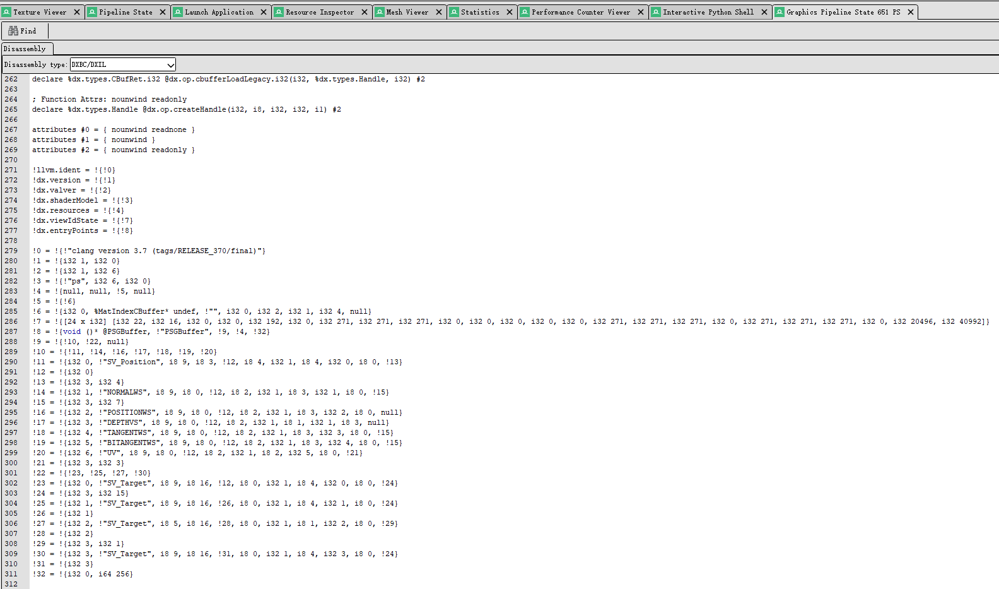

### DXIL to HLSL

&emsp;&emsp;转化DXIL到HLSL的工具。

&emsp;&emsp;使用`dxil-spirv`转化`DXIL`到`SPIRV`, 然后使用`spirv-cross`转化`SPIRV`到`HLSL`。

### 先决条件

&emsp;&emsp;确保`spirv-cross`在你的环境中, 你可以在命令行运行`spirv-cross`来检查。

&emsp;&emsp;如果你没有`spirv-cross`, 一个很简单的办法是安装vulkan sdk。

### 如何集成到renderdoc中

&emsp;&emsp;这个工具可以作为插件集成到renderdoc中, 来检查dxil shader逻辑. 但是你不能去修改并应用反编译后的hlsl，因为renderdoc当前版本dx12只支持dxbc的应用。

1. 下载Release并解压获得 `DXILDecompile.bat`、`DXILDecompile.py`、`dxil-spirv.exe` and `dxil-spirv-c-shared.dll`, 后两个文件也可以自己去dxil-spirv编译。
2. 将这四个文件放在同一个目录下。
3. Renderdoc -> Tools -> Settings -> Shader Viewer -> Add
    | Field | Value |
    |------|:--------------:|
    | Name | DXIL2HLSL |
    | Tool Type | Custom Tool |
    | Executable | 设置`DXILDecompile.bat`的绝对路径 |
    | Command Line | {input_file} |
    | Input/Output | DXIL/HLSL |

