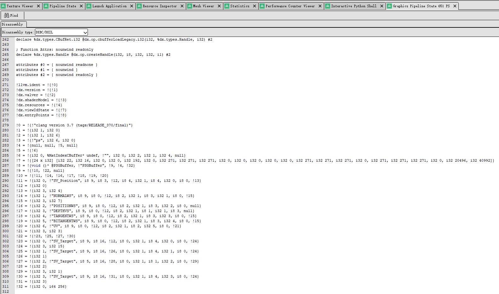
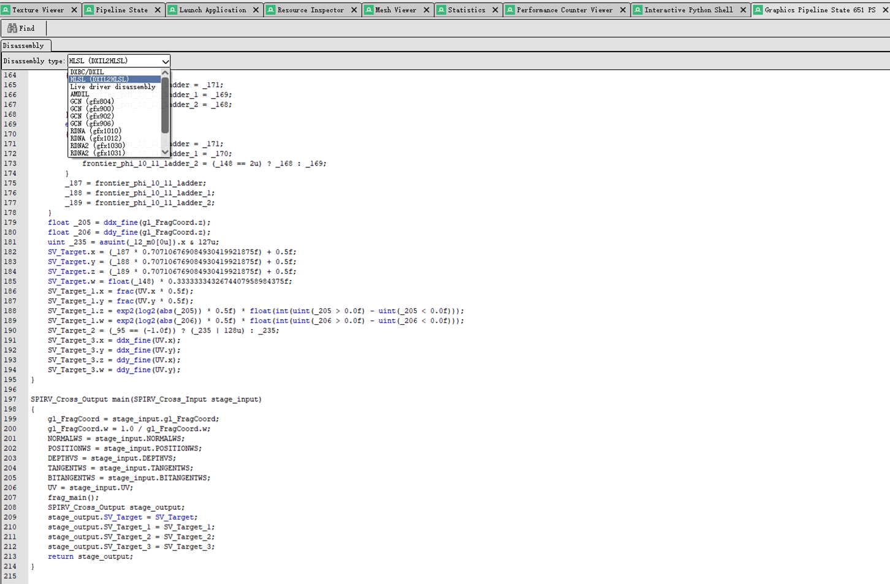

### DXIL to HLSL

&emsp;&emsp;Convert tools for DXIL to HLSL.

&emsp;&emsp;Use dxil-spirv convert DXIL to SPIRV, and use spirv-cross convert SPIRV to HLSL.

### Environment

&emsp;&emsp;make sure the `spirv-cross` in your environment, you can run `spirv-cross` in commandline to check it.

&emsp;&emsp;if you have not `spirv-cross`, you can install vulkan sdk to get it.

### How to integrate into renderdoc

&emsp;&emsp;This tool can be integrated into renderdoc as a plugin, you can use it to view dxil shader, but you can't apply it later, because renderdoc current version is only supports dxbc apply in dx12.

1. Download release unzip to get `DXILDecompile.bat`、`DXILDecompile.py`、`dxil-spirv.exe` and `dxil-spirv-c-shared.dll` or build dxil-spirv to get the last two files.
2. Put the four files in the same directory.
3. Renderdoc -> Tools -> Settings -> Shader Viewer -> Add
    | Field | Value |
    |------|:--------------:|
    | Name | DXIL2HLSL |
    | Tool Type | Custom Tool |
    | Executable | Set absolute path of `DXILDecompile.bat` |
    | Command Line | {input_file} |
    | Input/Output | DXIL/HLSL |

